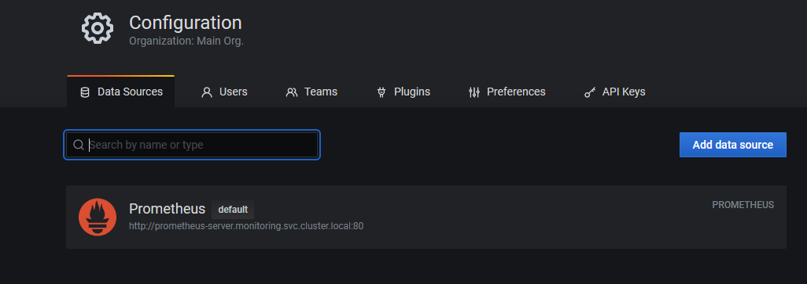
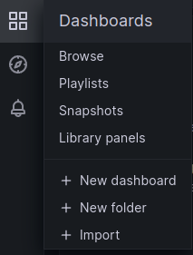
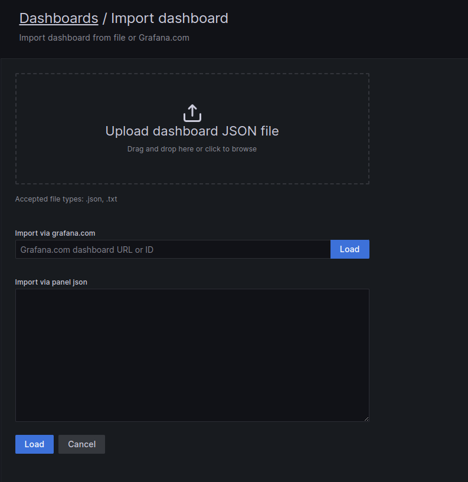

# Setup

🚀 Make sure cluster autoscaling (adding/deleting of the nodes) is turned on, to accommodate variable load traffic."
<br>
📦 Make sure the nodes have enough capacity."
<br>
🔀 Include examples to port-forward Grafana svc. For example: kubectl port-forward svc/grafana 3000:3000 -n grafana"
<br>
🎯 Make sure that Prometheus is configured to scrape data from pushgateway and istio (as a target source)
<br>
🔗 Change the prometheus and pushgw urls in override config file"
<br>
🔗 Please ensure to change the image name in smartscaler-inference.yaml"

## Cluster Setup

🖥️ Capacity:

- CPU: 4CPU
- Ephemeral Storage: 52,416,492Ki
- Memory: 16,181,724Ki
- Pods: 58
- node.kubernetes.io/instance-type=t3.xlarge

📊 Allocatable:

- CPU: 3920 mCPU
- Ephemeral Storage: 47,233,329,7124
- Memory: 15,164,892Ki
- Pods: 58
- node.kubernetes.io/instance-type=t3.xlarge

## Kubernetes and KEDA Version Compatibility

Choose the KEDA version based on your Kubernetes (eks/k8s) version:

| KEDA  | Kubernetes    |
| ----- | ------------- |
| v2.11 | v1.25 - v1.27 |
| v2.10 | v1.24 - v1.26 |
| v2.9  | v1.23 - v1.25 |
| v2.8  | v1.17 - v1.25 |
| v2.7  | v1.17 - v1.25 |

For Kubernetes v1.27, install KEDA using Helm:

```bash
helm install keda kedacore/keda --namespace keda --version 2.11
```

## Grafana

Grafana is used for monitoring. It has two points of access:

1. To feed data into Grafana.
2. To access Grafana to visualize the data.
   For example, you can use port-forward to access Grafana. However, do not use port-forward for the bookinfo.

### Grafana Datasource Setup

1. Click on the gear icon on the left side of the screen.
2. Click on Add data source.
3. Select Prometheus.
4. Enter the URL of the Prometheus server. For example, http://prometheus-server.monitoring.svc.cluster.local:80.
5. click on Save & Test



### Grafana Dashboard Setup

1. Click on the 4square icon on the left side of the screen.
2. Select + Import.
   
3. Upload the Smart_Scaler_Dashboard.json file from the files directory.
   

## Script Notes

- Have 1 cluster to setup Bookinfo HPA and another cluster with Smart-scaler.
- In the Script, there is an option to setup the cluster with Smart-scaler.
  `Do you want to continue with the installation of smart-scaler? (yes/no)"`
- If you choose yes, then it will install the smart-scaler in the cluster.
